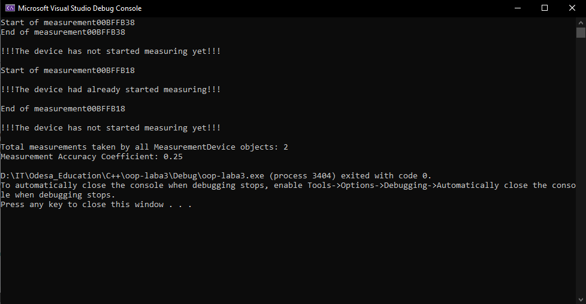

# Лабораторна робота 3. Статичні дані та методи

На цій лабораторній роботі було додано до класу "MeasurementDevice" статичні змінні та статичні методи, завдяки яким ми можемо переглядати та задавати значення цим змінним. Також було вивчено та на практиці засвоєно про цей вид змінної і також про її особливості в об'єктно орієнтованому програмуванні.

З таким вмістом `main`:

```cpp
int main() {
	MeasurementDevice::setMeasurementAccuracyCoefficient(0.25);

	MeasurementDevice thermometer("Thermometer", "Celsius", -50, 150, "Plastic");
	MeasurementDevice ruler("Ruler", "Centimeters", 0, 30, "Wood");

	thermometer.startMeasuring();
	thermometer.stopMeasuring();

	ruler.stopMeasuring();
	ruler.startMeasuring();
	ruler.startMeasuring();
	ruler.stopMeasuring();
	ruler.stopMeasuring();

	std::cout << "Total measurements taken by all MeasurementDevice objects: " << MeasurementDevice::getTotalMeasurements() << std::endl;
	std::cout << "Measurement Accuracy Coefficient: " << MeasurementDevice::getMeasurementAccuracyCoefficient() << std::endl;

	return 0;
}
```

маю ось такі результати тестування програми:


